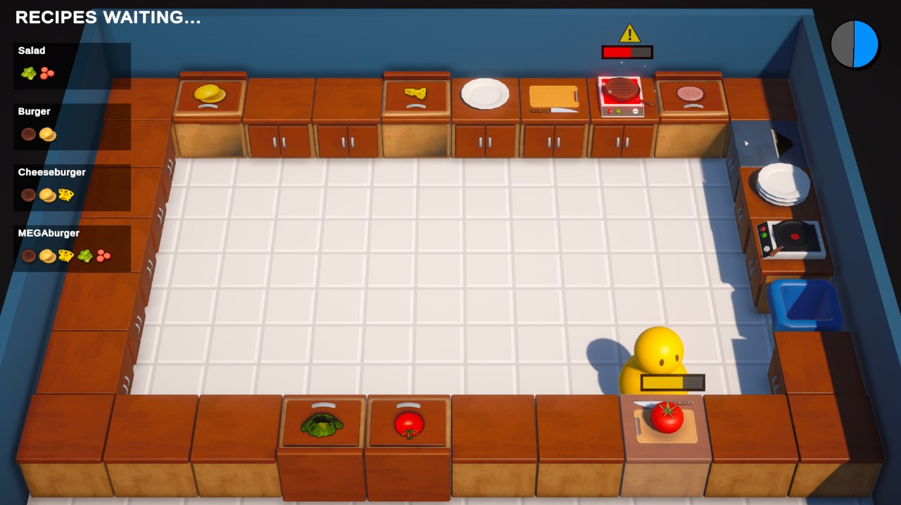
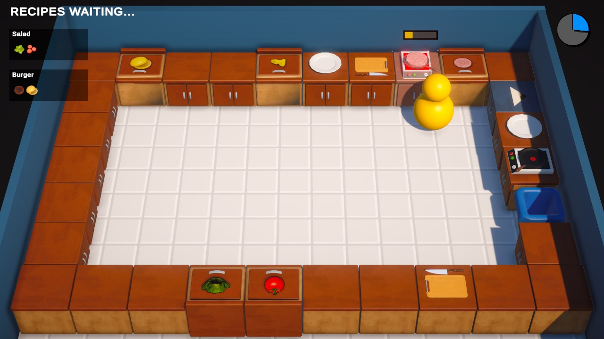

# Chaos Kitchen

**Chaos Kitchen** is a fast-paced, single-level cooking simulation game inspired by the popular game _Overcooked_. Players are challenged to prepare and serve a variety of recipes that appear randomly, all while managing the chaos of a busy kitchen. The game supports both keyboard and controller input.

## Features

- **Single-Level Gameplay:** Dive into a hectic kitchen environment with one action-packed level.
- **Randomized Recipes:** Multiple recipes appear randomly to keep the gameplay dynamic and challenging.
- **Controller Support:** Play using a controller for a more immersive experience.
- **Beginner-Friendly Development:** Built with Unity, this project reflects my journey as a beginner game developer.

## Example Images and Videos





## How to Play

1. **Start the Game:**

   - Launch the game from the provided executable file.

2. **Controls:**

   - **Keyboard:** Use the arrow keys/WASD to move, and the spacebar or E key to interact.
   - **Controller:** Use the joystick to move and the A button to interact.

3. **Objective:**
   - Prepare the recipes as they appear on the screen.
   - Follow the steps: chop, cook, assemble, and serve the dishes within the time limit.
   - Complete as many orders as possible before time runs out!

## Installation

1. Clone the repository:

   ```bash
   git clone https://github.com/Rithish-Sripaul/ChaosKitchen.git
   ```

2. Navigate to the project directory:

   ```bash
   cd ChaosKitchen
   ```

3. Extract the zip file, and run the game via the Executable file. Enjoy!

## Known Issues

- No multiplayer functionality is currently implemented.
- The game contains only one level.
- Minor bugs with recipe randomization under certain conditions.

## Future Plans

- Adding more levels with unique challenges.
- Implementing a multiplayer mode for cooperative play.
- Enhancing the recipe system with more complexity and variety.

## Contributing

Feel free to fork this repository and submit pull requests if you'd like to contribute. Suggestions for improvements are always welcome!

## License

This project is licensed under the MIT License - see the [LICENSE](LICENSE) file for details.
